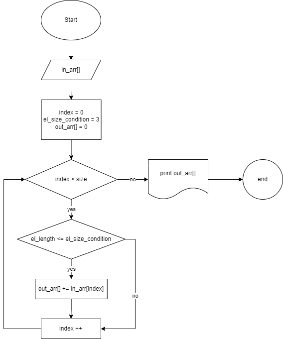

# Итоговый проект блока IT-специалист
## Для сдачи итогового проекта необходимо выполнить следующие действия:

1. Создать репозиторий на GitHub
2. Нарисовать блок-схему алгоритма (можно обойтись блок-схемой основной содержательной части, если вы выделяете её в отдельный метод)
3. Снабдить репозиторий оформленным текстовым описанием решения (файл README.md)
4. Написать программу, решающую поставленную задачу
5. Использовать контроль версий в работе над этим небольшим проектом (не должно быть так, что всё залито одним коммитом, как минимум этапы 2, 3, и 4 должны быть расположены в разных коммитах)

**Пункт 1**
---
Создавать репозиторий мы уже давно умеем и практикуем:) Описания излишни:)

**Пункт 2**
---
Сначала на бумаге, а после в онлайн редакторе https://app.diagrams.net/ рисуем красивую блок-схему и прикрепляем её в readme.md, чтобы преподавателю не пришлось смотреть разные всякие файлы.

**Пункт3**
---
Его мы прямо сейчас и делаем.

**Пункт 4**
---
**Задача**: Написать программу, которая из имеющегося массива строк формирует новый массив из строк, длина которых меньше, либо равна 3 символам. Первоначальный массив можно ввести с клавиатуры, либо задать на старте выполнения алгоритма. При решении не рекомендуется пользоваться коллекциями, лучше обойтись исключительно массивами.

**Примеры:**

[“Hello”, “2”, “world”, “:-)”] → [“2”, “:-)”]

[“1234”, “1567”, “-2”, “computer science”] → [“-2”]

[“Russia”, “Denmark”, “Kazan”] → []

**Шаг 1**: создаём массив. Для этого определяем объявляем переменную _**text**_ с типом _**string[]**_ (строковый массив) и присваиваем ей значения с рандомным текстом, в котором каждое слово или цифра имеет разную длинну:

    string[] text = { "random", "set", "of", "words", "in", "English", "15/07/1988", "2", "375" };

**Шаг 2**: выводим строковый массив на печать. Для этого запускаем цикл _**for**_, внутри которого объявляем переменную _**i**_ с типом _**int**_ (целое число), устанавливаем ограничение цикла размером массива _**text**_ и добавляем условие _**i++**_, которое при завершении каждого прохода цикла плюсует 1 к индексу _**i**_. При выполнении цикла пишем команду _**Console.Write**_, которая выводит результат в консоль. По завершении цикла _**for**_ добавляем команду _**Console.WriteLine**_, которя добавит нам пустую строку и тем самым отделит выведенный массив от следующей информации:

    for (int i = 0; i < text.Length; i++)

    {

        Console.Write($"{text[i]} ");

    }

    Console.WriteLine();
После выполнения кода получаем результат:

_random set of words in English 15/07/1988 2 375_

_**Шаг 3**_: находим элементы массива, длина которых меньше либо равна 3. Для этого запускаем цикл _**foreach**_. Данный цикл проходит по всем элементам массива и при соблюдении условия _**if**_ выполняет заданную команду, в нашем случае - вывести элемент в консоль:

    foreach (string el in text)
    {
        if (el.Length <= 3)
        {
            Console.Write($"{el} ");
        }
    }
После выполнения кода получаем результат:

_set of in 2 375_

Несмотря на кажущуюся сложность задачи решение занимает всего несколько строк.

В принципе, его можно уместить и в 3 строки:

    for (int i = 0; i < text.Length; i++) Console.Write($"{text[i]} ");
    Console.WriteLine();
    foreach (string el in text) if (el.Length <= 3) Console.Write($"{el} ");
Но для большей читаемости оставим как указано в примерах выше.

**Пункт 5**
---
С контролем версий тоже всё просто. Если бы некоторые личности читали задание целиком, то можно было бы красиво и по порядку всё законтролить в github:)
Небольшая просьба - при предоставлении обратной связи по моему домашнему заданию прошу начать его с фразы "Привет, студент!". Мне будет приятно)

# **Благодарю за внимание!**